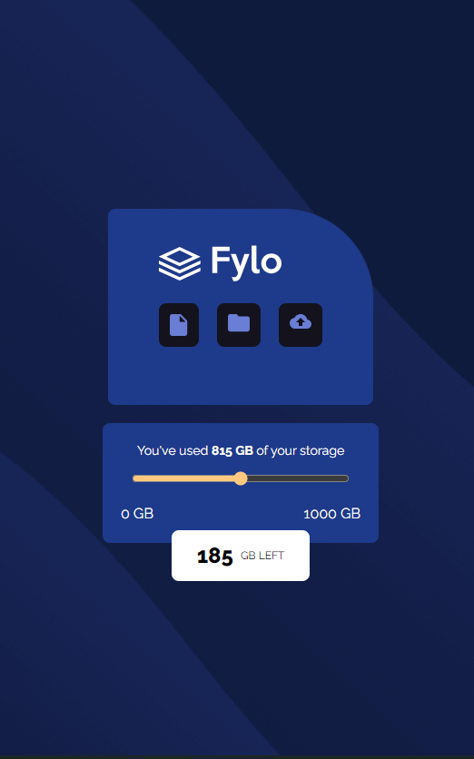

## Table of contents

- [Overview](#overview)
- [The challenge](#the-challenge)
- [Screenshot](#screenshot)
- [Links](#links)
- [My process](#my-process)
- [Built with](#built-with)
- [What I learned](#what-i-learned)

## Overview

## The challenge

Users should be able to:

- View the optimal layout for the site depending on their device's screen size

# LINK

[CLICK ME FOR LIVE VIEW] (https://miron-silviu.github.io/data-storage-component/)

## Screenshot

## My process

Start building the project from the beginning using HTML and Tailwind.

## Built with

- Semantic HTML5 markup
- CSS custom properties
- Flexbox
- Mobile-first workflow

## What I learned

I learned who to use classes in Tailwind in particular how to use absolute position
